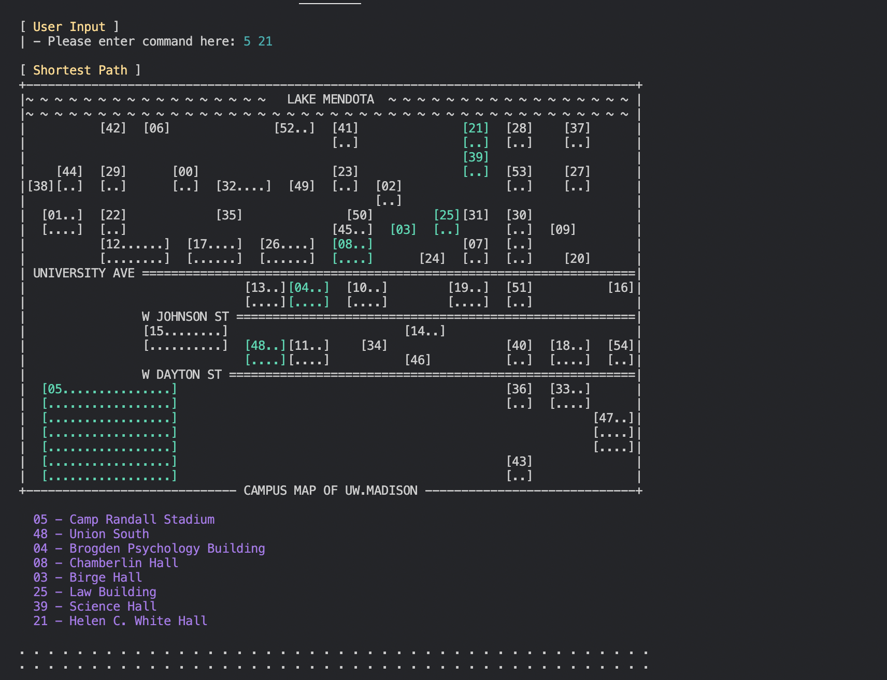
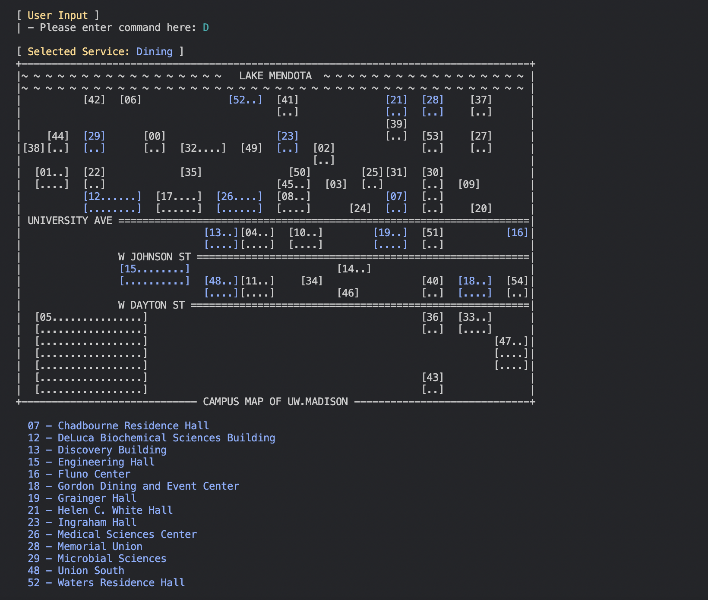

## campus-mapper

### Description
This project is an adaptation of an assignment from the CS400 Spring 2021 class. The primary objective is to implement an application based on Dijkstra's shortest path algorithm. The project focuses on creating a campus mapper that reads data from a dataset containing over fifty buildings in the eastern part of the UW-Madison campus.

Users have the capability to select two buildings by their ID, prompting the program to compute and display the shortest path between them. 

Additionally, users can highlight buildings offering specific services such as dining, library, and parking. The program responds by displaying a mapped representation highlighting the selected buildings and providing a list of relevant buildings with the specified services.

### Data Structure and Algorithm Features
- Utilized *class, record, enum, and interface* for code organization.
- Employed *HashMap, PriorityQueue, ArrayList, and Arrays* to efficiently manage data and implement algorithms.
- Incorporated *ANSI escape sequences* for enhanced console output formatting.
- Facilitated user interaction through *Scanner and parsing* techniques.
- Implemented *Dijkstra's shortest path algorithm* for computing optimal routes between buildings in the campus mapper.
- Implemented robust Exception handling for graceful error management.

### Project Structure
- `MapApp.java`: Main application file responsible for initializing and running the campus mapping application.
- `Building.java`: Defines the `Building` class with attributes such as ID, name, and services, encapsulating information about campus buildings.
- `DataReader.java`: Responsible for reading and parsing data, providing well-organized data structures for the `MapApp` to use.
- `Graph.java`: Implements the graph structure, exclusively accepting integers as nodes, and incorporates Dijkstra's shortest path algorithm for pathfinding.
- `NodeTuple.java`: Lightweight helper class providing tuples with node ID, cost, and previous node information, designed for use in the Dijkstra's algorithm.
- `Color.java`: Utility class defining ANSI escape sequence colors for rendering console output, enhancing the visual representation of the application.
- `Text.java`: Utility class that stores static messages used throughout the application, facilitating centralized message management.
- `MapCell.java`: Defines the `MapCell` entity, offering functionality for easy formatting, including setting and resetting colors for messages in the console output.

### Usage
- Clone the whole repo to Linux environment
- Run script `run_mapper.sh` to compile and run the app
